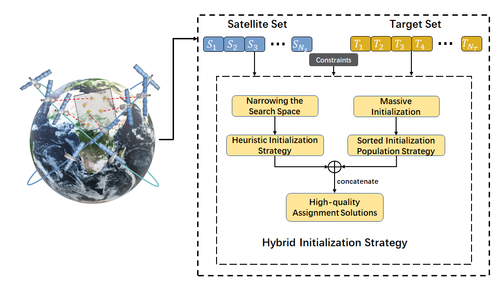

# HIDE
Hybrid Initialization Differential Evolution for Multi-Satellite Scheduling

### :bulb: Initialization Strategy Improved Differential Evolution for Multiple Agile Satellites Scheduling Under Actuator Faults

### keyword
Agile satellite scheduling, Task planning, Reinforcement learning, Satellite attitude control, Fault-tolerant control.

> Abstract: Agile satellites represent the next generation of Earth Observation Satellites (EOS), characterized by enhanced attitude maneuverability. 
As observation targets shift from static ground-based objects to time-sensitive moving targets, the rapid movement of these targets poses significant challenges to satellite observation tasks. 
The combination of high satellite agility and rapid target movement makes the scheduling of multiple Agile Earth Observation Satellites (AEOS) inherently complex. 
Furthermore, potential actuator faults in satellites add to the complexity of attitude control and mission scheduling.
Motivated by these challenges, this study addresses the scheduling problem for multiple AEOS tracking time-sensitive moving targets under actuator faults, with the goal of maximizing overall observation profit. 
To tackle the planning and optimization difficulties for large-scale observation tasks, we propose an improved Differential Evolution (DE) algorithm incorporating a Hybrid Initialization strategy to enhance the quality of initial solutions, along with additional advanced techniques such as destroy-and-repair mechanism. 
The proposed evolutionary algorithm is implemented on GPUs to accelerate computation and improve efficiency in large-scale scheduling scenarios.
At the control level, the tracking problem under actuator faults is reformulated as an attitude control problem, for which we develop a fault-tolerant reinforcement learning (RL) framework to ensure robust target tracking. 
Experimental results demonstrate the effectiveness of our approach, showcasing both the superior performance of the heuristic scheduling strategy based on the improved DE algorithm and the reliable tracking capability of the RL-based control method.
